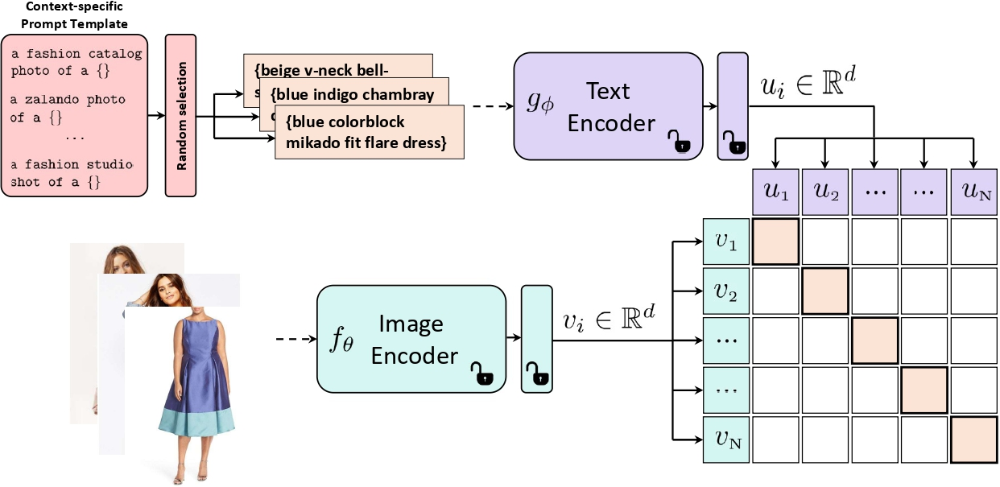

# OpenFashionCLIP (ICIAP 2023)
### Vision-and-Language Contrastive Learning with Open-Source Fashion Data
[**Giuseppe Cartella**](https://scholar.google.com/citations?hl=en&user=0sJ4VCcAAAAJ),
[**Alberto Baldrati**](https://scholar.google.com/citations?hl=en&user=I1jaZecAAAAJ),
[**Davide Morelli**](https://scholar.google.com/citations?user=UJ4D3rYAAAAJ&hl=en),
[**Marcella Cornia**](https://scholar.google.com/citations?hl=en&user=DzgmSJEAAAAJ),
[**Marco Bertini**](https://scholar.google.com/citations?user=SBm9ZpYAAAAJ&hl=en),
[**Rita Cucchiara**](https://scholar.google.com/citations?hl=en&user=OM3sZEoAAAAJ)

This is the **official repository** for the paper [**OpenFashionCLIP: Vision-and-Language Contrastive Learning with Open-Source Fashion Data**](https://iris.unimore.it/retrieve/2e539813-e1e2-49a3-825f-961ee9c6bde5/2023-iciap-fashion.pdf), ICIAP 2023.
## 🔥 News 🔥
- **`1 July 2023`** Our work has been accepted for publication to [ICIAP 2023](https://iciap2023.org/) 🎉 🎉 !!!

## Overview

<p align="center">
    
</p>

>**Abstract**: <br>
> The inexorable growth of online shopping and e-commerce demands scalable and robust machine learning-based solutions to accommodate customer requirements. In the context of automatic tagging classification and multimodal retrieval, prior works either defined a low generalizable supervised learning approach or more reusable CLIP-based techniques while, however, training on closed source data. In this work, we propose OpenFashionCLIP, a vision-and-language contrastive learning method that only adopts open-source fashion data stemming from diverse domains, and characterized by varying degrees of specificity. Our approach is extensively validated across several tasks and benchmarks, and experimental results highlight a significant out-of-domain generalization capability and consistent improvements over state-of-the-art methods both in terms of accuracy and recall.


## Citation
If you make use of our work, please cite our paper:

```bibtex
@inproceedings{cartella2023open,
  title={OpenFashionCLIP: Vision-and-Language Contrastive Learning with Open-Source Fashion Data},
  author={Cartella, Giuseppe and Baldrati, Alberto and Morelli, Davide and Cornia, Marcella and Bertini, Marco and Cucchiara, Rita},
  booktitle={Proceedings of the International Conference on Image Analysis and Processing},
  year={2023}
}
```

## TODO
Source code and trained models will be release soon.

## Acknowledgements
This work has partially been supported by the European Commission under the PNRR-M4C2 (PE00000013) project "FAIR - Future Artificial Intelligence Research" and the European Horizon 2020 Programme (grant number 101004545 - ReInHerit), and by the PRIN project "CREATIVE: CRoss-modal understanding and gEnerATIon of Visual and tExtual content" (CUP B87G22000460001), co-funded by the Italian Ministry of University.

## License
<a rel="license" href="http://creativecommons.org/licenses/by-nc/4.0/"></a><br />All material is available under [Creative Commons BY-NC 4.0](https://creativecommons.org/licenses/by-nc/4.0/). You can **use, redistribute, and adapt** the material for **non-commercial purposes**, as long as you give appropriate credit by **citing our paper** and **indicate any changes** you've made.
